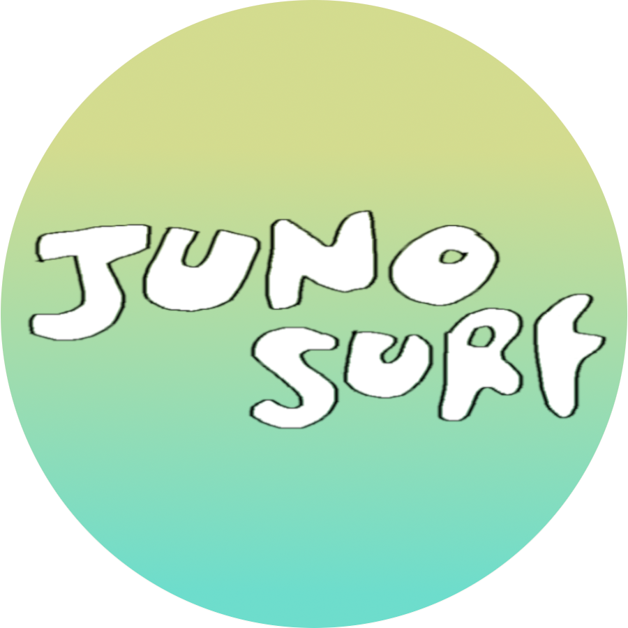

  

---

## Product Description

Juno Surf is a free local surf forecasting application specific to the Juno Beach,Jupiter, Florida area. Created by Ian Flynn

The goal of the app is to provide a light and intuitive UI that is easier to manage for all levels of surf knowledge. No heavy graphing, just the 5 basic things that make for a great surf.

---

## Contribute

This is an Open Source app, so I would love to hear any and all suggestions. I will of course consider and welcome all pull requests that contribute to the goal.

Some of my planned features include:

- Testing Suite
- Backend setup with Node/Express
- OAuth
- MongoDB for user data
  -- Store closest buoy to user, so the app displays more relevant data.
- And more...

---

### License | MIT
